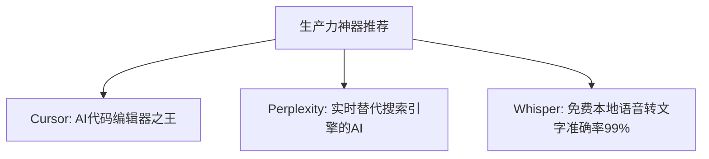

欢迎来到《硬核AI工具红黑榜》Vol.2！当生成式 AI 热潮席卷全球，市面上涌现出了成百上千款套壳 AI 软件。许多工具靠营销噱头赚足了眼球，实测体验却惨不忍睹。本文将为你剥离套壳噱头，带来真正的硬核避坑分析。

---

### 💣 黑榜名单：过度吹捧的“踩雷”软件

#### 1. 各种付费“套壳网页客户端”
* **踩雷原因**：本质上只是用 Electron 封装了官方网页，甚至使用低价共享 API 密钥。经常出现对话额度受限、随时跑路风险，每月却收取高昂订阅费。
* **替代方案**：直接使用开源的 **NextChat (ChatGPT Next Web)** 或 **Lobe Chat**，填入自建 API 密钥，体验完胜付费套壳软件。

#### 2. 宣称“一键生成完本小说/千字论文”的伪 AI 创作神仙软件
* **踩雷原因**：生成的文本充满了大量重复词汇、无意义的废话套话，上下文逻辑前后矛盾，完全达不到出版或交作业的最低标准。
* **替代方案**：使用 **Claude 3.5 Sonnet** + 分章节提纲递进式生成，人工介入控制每章走向。

---

### ✨ 红榜名单：真正低调高效的生产力利器

1. **Cursor IDE**：基于 VS Code 深度定制的 AI 代码编辑器，真正实现了全项目上下文理解与智能 Tab 补全。
2. **Perplexity AI**：真正的实时 AI 搜索，每条结论附带权威网页引用来源，彻底解决传统搜索引擎广告成灾的问题。

---

> **免责声明**：本文仅供网络技术交流、学术研究与客观测速参考，请遵守当地法律法规，购买与使用决策请自行审慎评估。
