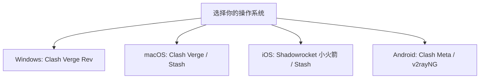

对于第一次接触代理网络的新手而言，面对不同的操作系统与纷繁复杂的代理软件，如何快速完成 **新手科学上网客户端配置** 常常令人头疼。本文将针对 Windows、macOS、iOS 和 Android 四大平台，为你带来一站式图文导入教程。

---

### 一、全平台客户端推荐一览

---

### 二、分平台详细配置步骤

#### 1. Windows 平台：Clash Verge Rev 配置教程
1. **下载安装**：前往 GitHub Release 页面下载最新的 `.msi` 安装包并安装；
2. **导入订阅**：打开软件，点击左侧 `订阅 (Profiles)` 菜单，将机场后台复制的 Clash 订阅 URL 粘贴至输入框，点击 `导入`；
3. **节点选择**：在 `代理 (Proxies)` 界面选择延迟最低的专线节点；
4. **开启代理**：勾选主界面的 `系统代理 (System Proxy)` 即可完成连接。

#### 2. iOS 平台：Shadowrocket（小火箭）配置教程
1. **获取应用**：登录外区 Apple ID 从 App Store 购买下载 Shadowrocket；
2. **一键导入**：在 Safari 浏览器中打开机场用户后台，点击“一键导入小火箭”按钮；
3. **启动连接**：返回小火箭首页，选择需要的节点（建议配合 **晚高峰不卡专线**），开启顶部开关，首次连接允许添加 VPN 配置即可。

#### 3. Android 平台：Clash Meta 配置教程
1. **安装 APK**：下载并安装 Clash Meta for Android；
2. **添加配置**：进入 `配置` ➔ `新配置` ➔ `URL`，粘贴订阅链接并保存下载；
3. **开启服务**：返回首页点击 `启动` 按钮，并在 `代理` 选项卡中挑选接入点。

---

### 三、分流模式切换建议

* **规则模式 (Rule)**：**日常强烈推荐开启**。国内流量直接走本地宽带，海外流量自动走代理节点。
* **全局模式 (Global)**：仅在特定网站无法打开或进行网络故障排查时临时开启。

---

> **免责声明**：本文仅供网络技术交流、学术研究与客观测速参考，请遵守当地法律法规，购买与使用决策请自行审慎评估。
