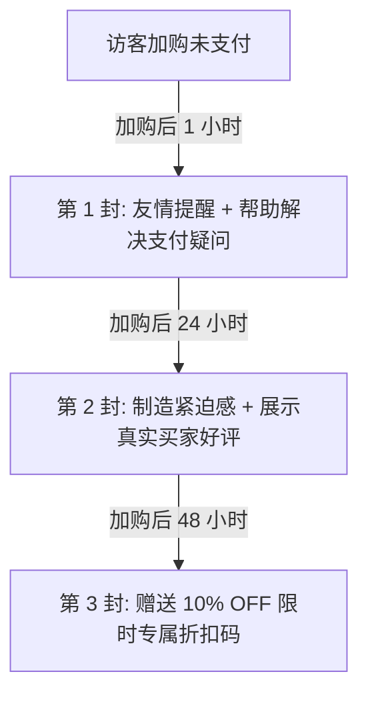

数据显示，跨境电商独立站的平均弃购率（Cart Abandonment Rate）高达 70% 以上。也就是说，每 100 个把商品加购的访客中，有 70 多人未完成支付。通过 **Klaviyo 自动化邮件工作流**，能帮助卖家挽回 15%-25% 的流失销售额。

---

### 一、废弃购物车挽回 3 封信黄金序列

#### 1. 第一封信（加购 1 小时后发送）：友情提醒与问题排查
* **主题**：`Did you leave something behind?`
* **内容**：不提供折扣，仅展示加购的商品图片，并询问是否在结账时遇到了卡单或支付问题。

#### 2. 第二封信（加购 24 小时后发送）：建立信任与库存紧迫感
* **主题**：`Your cart is about to expire!`
* **内容**：提示库存紧张，同时附带 2 条五星买家带图 Review 建立信任感。

#### 3. 第三封信（加购 48 小时后发送）：临门一脚折扣终结
* **主题**：`Here is a 10% OFF coupon for your cart!`
* **内容**：提供限时 24 小时有效的专属折扣码，彻底促成最终转化。

---

### 二、Klaviyo 关键指标与优化建议

* **打开率 (Open Rate)**：保持在 35% 以上，关键在于优秀的邮件标题与预览切入点；
* **点击率 (Click Rate)**：保持在 5% 以上，使用醒目的 Call To Action 按钮（如 `Complete My Order`）。

---

> **免责声明**：本文仅供网络技术交流、学术研究与客观测速参考，请遵守当地法律法规，购买与使用决策请自行审慎评估。
