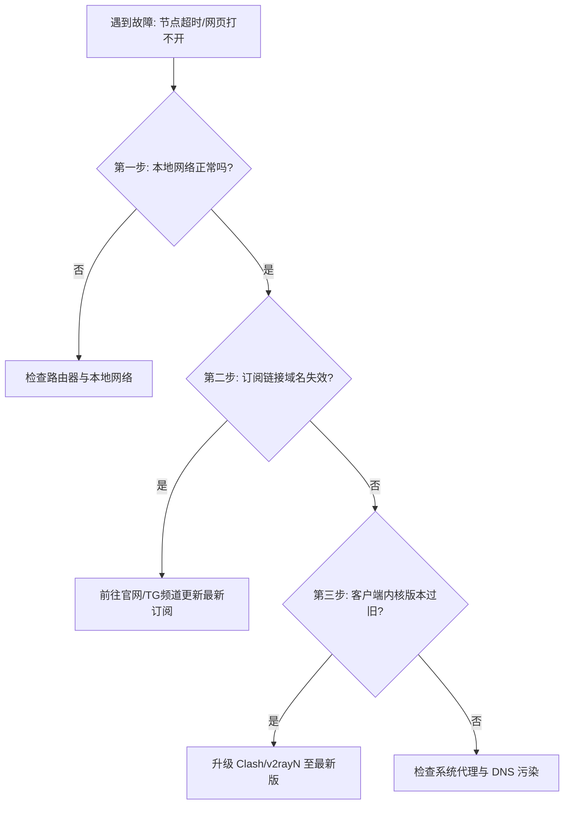

在日常使用网络代理时，突然遇到的“节点连接超时”、“订阅更新失败”或“网页无限加载”常常让人十分抓狂。本文将整理 6 种最有效的排查与自我修复方法。

---

### 一、6 种常见故障排查诊断流程

#### 1. 排查机场订阅域名阻断与变更
* **现象**：点击“更新订阅”提示 `HTTP 404` 或 `Connection Timed Out`。
* **解决方法**：部分服务商由于旧域名受封而启用了备用域名，请登录官网后台或 Telegram 通告群获取最新订阅 URL 重新导入。

#### 2. 排查客户端内核版本过旧
* **现象**：支持 VLESS-Reality 或 Hysteria2 的节点导入后直接报错。
* **解决方法**：老旧客户端内核不支持新协议，将 **Clash Verge Rev** 或 **v2rayN** 升级至最新稳定发布版即可解决。

#### 3. 排查本地 DNS 污染与系统代理挂死
* **解决方法**：在客户端开启 `DoH (DNS over HTTPS)`，或在 Windows 终端中运行 `netsh winsock reset` 重置网络栈后重启电脑。

---

### 二、排查指南速查表

| 故障现象 | 可能原因 | 一键解决办法 |
| :--- | :--- | :--- |
| **订阅更新失败** | 域名被阻断 / 套餐到期 | 重新复制最新订阅 URL / 续费 |
| **节点延迟显示正常但无法上网** | 系统代理未开启 / DNS 污染 | 勾选“系统代理”，开启 DoH |
| **仅个别节点提示超时** | 节点维护 / 晚高峰出口拥堵 | 切换至 **晚高峰不卡专线** 节点 |

---

> **免责声明**：本文仅供网络技术交流、学术研究与客观测速参考，请遵守当地法律法规，购买与使用决策请自行审慎评估。
