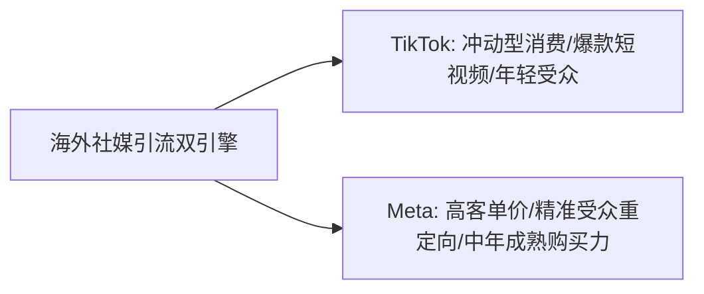

2026 年的海外流量格局中，TikTok 的短视频兴趣电商与 Meta（Facebook / Instagram）的精准受众广告依然是出海引流的两大超级双引擎。本文将为你拆解引流矩阵搭建与广告避坑策略。

---

### 一、TikTok 与 Meta 广告特性对比

---

### 二、TikTok 社媒矩阵搭建 3 步法

1. **一主多副账号矩阵**：设置 1 个官方品牌主账号（打造品牌形象），搭配 5-10 个副账号（针对不同细分产品场景输出剪辑视频）。
2. **本土化内容生成**：利用 AI 视频脚本工具生成符合当地文化习惯的台词，配合 CapCut / HeyGen AI 虚拟人生成原生短视频。
3. **主页挂链引流独立站**：主页账号达到 1000 粉丝后挂载 Linktree / Shopify 落地页链接，形成流量闭环。

---

### 三、Meta 广告投放四大避坑法则

* **法则一：素材决定 70% 的 ROAS**：不要死磕出价策略，每周测试 5-10 组不同风格的图片与短视频素材。
* **法则二：避开广告账户封禁陷阱**：使用干净的 BM (Business Manager) 绑定企业 Payoneer / 虚拟信用卡，避免个人卡频繁拒绝扣款引发封号。
* **法则三：安装 Meta Pixel 与 CAPI**：配置服务器端 API (CAPI) 跟踪，弥补 iOS 14.5+ 之后隐私拦截造成的转化丢失。

---

> **免责声明**：本文仅供网络技术交流、学术研究与客观测速参考，请遵守当地法律法规，购买与使用决策请自行审慎评估。
