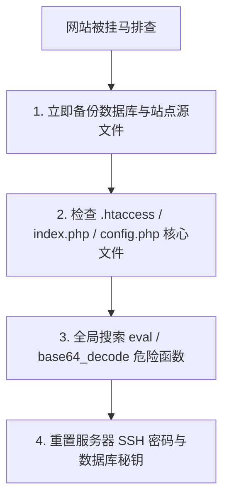

对于个人博主与网站站长而言，最噩梦的体验莫过于网站访问突然跳转到非法赌博页面，或被 Google/Bing 标记为“该网站可能已被黑”。这就是俗称的“网页被挂马”。本文将介绍排查与彻底清理恶意代码的全流程。

---

### 一、网页被挂马的 3 种常见形式

1. **暗链与篡改跳转**：黑客通过漏洞向 `.htaccess` 或 `index.php` 写入恶意 JS 脚本，当搜索引擎爬虫或特定移动端访客打开时自动跳转至恶意网址。
2. **Webshell 后门**：在网站图片上传目录（如 `uploads/`）中上传带有 `.php` 后门脚本，随时控制网站服务器。
3. **数据库植入**：恶意恶意代码被批量插入数据库的文章字段或配置表之中。

---

### 二、彻底清理恶意代码 4 步排查法

1. **对比干净备份文件**：利用 `git diff` 或文件对比工具，将受感染站点与官方干净源码对比，找出被篡改的文件。
2. **清理后门木马**：在 Linux 服务器终端运行 `find ./ -name "*.php" | xargs grep -i "eval"` 查找后门。
3. **提交搜索引擎重新审核**：清理完成后，登录 Google Search Console 与 Bing Webmaster Tools 提交“请求审核”以恢复收录状态。

---

> **免责声明**：本文仅供网络技术交流、学术研究与客观测速参考，请遵守当地法律法规，购买与使用决策请自行审慎评估。
